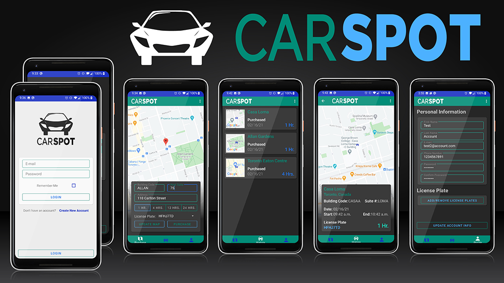

# CarSpot - Android Parking App

### Authors
[Brian Domingo](https://github.com/BrianJayD)\

[Daryl Dyck](https://github.com/daryldyck/)\
___

___
## About The Project
### Login Page
##### By Brian Domingo

**Features include:**
- Built in Java
- Uses Google Firestore to store user data
- Uses Google Authentication to verify login
___
### Profile Page
##### By Brian Domingo

**Features include:**
- XML ui changes appearance depending if user is creating a new profile or updating an existing profile.
- Uses Google FireStore for CRUD operations.
- Uses FirebaseAuth to create and update user email and password.
___
### Purchase Ticket Page
**_By Daryl Dyck_**

**Features include:**
- Google MapView with current location annotation
- Forward Geocoding (Fetching location from street address)
- All user data retrieved from Google FireStore
___
### Ticket History Page
##### By Daryl Dyck

**Features include:**
- RecyclerView with all previous parking tickets
- All ticket data retrieved from Google FireStore
- Google MapView snapshot image stored with Google Cloud Storage
- Shared element transition animations
___
### Ticket Details Page
##### By Daryl Dyck

**Features include:**
- Google MapView with current location of parking ticket
- Reverse geolocation used to get parking location from latitude and longitude
___
#### Additional items
- Logo & App Icon by Daryl Dyck
- Screenshots & Screen Recording by Daryl Dyck
- All color assets added by Daryl Dyck
- App framework by Daryl Dyck
